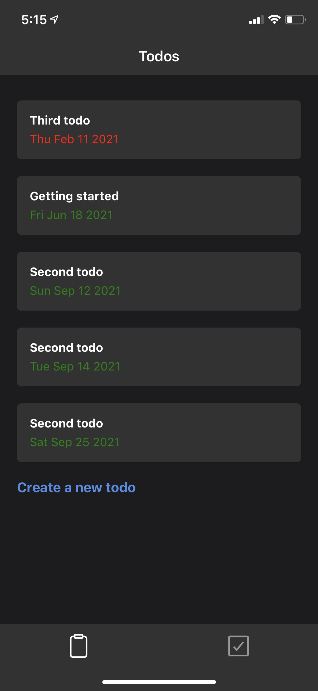
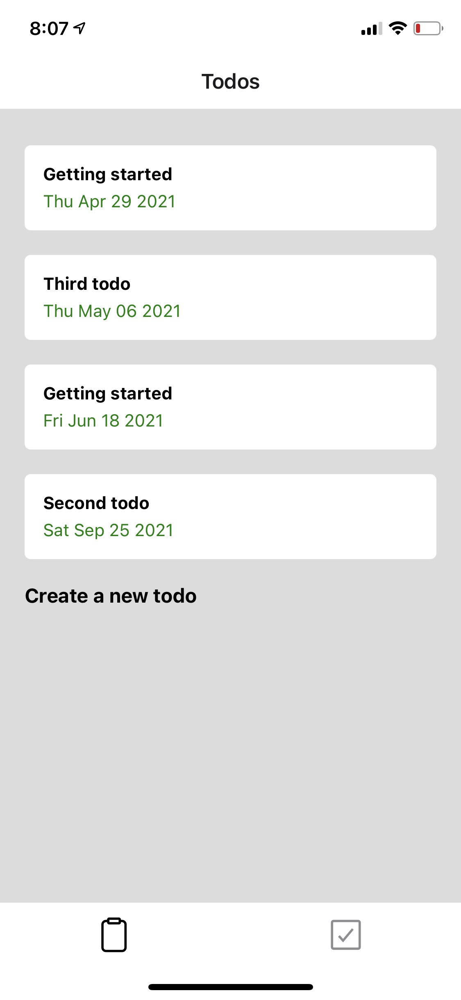
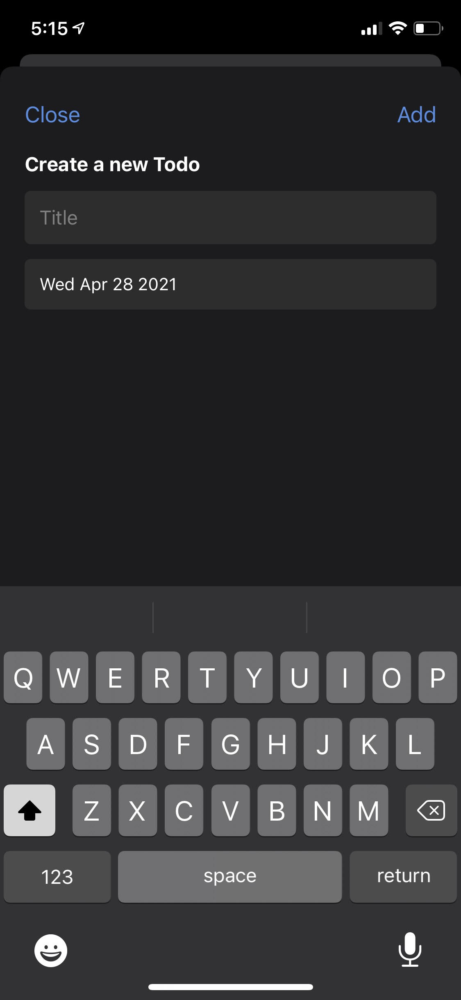
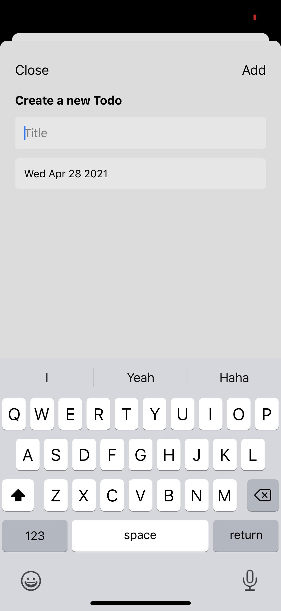
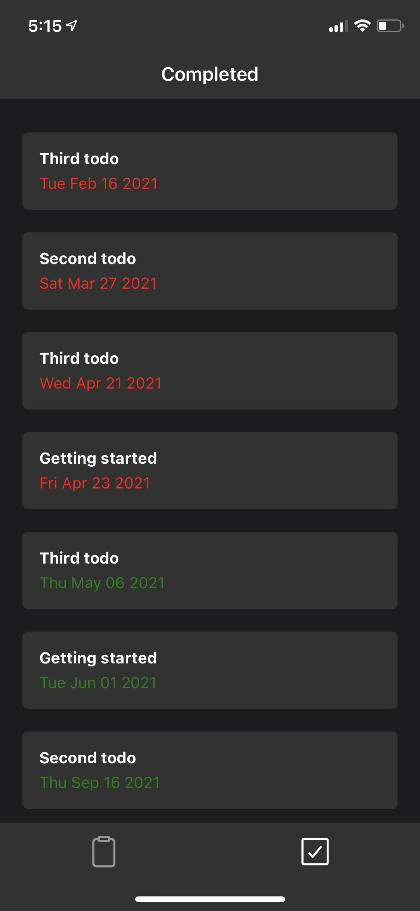
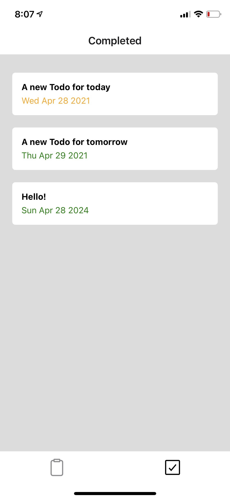

# Apply Innovations Frontend Assignment

## Your task

Build a front end system according to the screen recorded example provided below. Your task is to build all the components and screens to provide a fast and convenient experience for the user. This is intended to be used as a mobile application and we will be testing your implementation on iOS and Andriod using expo. 

## Setup

To get started you must setup your development environment by installing the required dependencies.

- Clone this repository
- Make sure [npm](https://www.npmjs.com/get-npm) is installed 
- Make sure [yarn](https://classic.yarnpkg.com/en/docs/install/#debian-stable) is installed
- Make sure [expo-cli](https://docs.expo.io/get-started/installation/) is installed
- Enter your lan ip address in the `native/App.tsx` for the graphql api. (Mine was 192.168.0.68)

Terminal 1 (this will host the expo server for frontend testing)
- cd native 
- expo install
- yarn start

Terminal 2 (this will host the graphql api so your frontend talks to your backend)
- cd server
- yarn install
- yarn start

## The design

This app is a task management app. The screens you will have to complete include:
| Screen | Dark | Light |
| ------ | ----- | ---- |
| Todos |  | 
| Create todo |  | 
| Completed todos |  | 

You can download and view the screen recordings [here](https://drive.google.com/drive/folders/1pQJX6zBZrn9K1GOXLoamR3i44qUIpHk5?usp=sharing).

## User features

- The user can click a button to add a todo
- The user can add a todo within a full screen popup giving a title and due date
- The user can view all todo items in a list, ordered by date
- The user can scroll through todos if they do not all fit on the screen
- The user can swipe to the left to delete a todo item
- The user can view all completed todos on the completed tab
- The user can swipe a todo to the right to mark it as completed and the completed todo moves to the completed tab
- The user can see the status of the todo: upcoming, today, overdue using the colors green, orange and red respectively
- (Bonus) The user should be able to change the theme of the app between light and dark mode according to their app settings
- (Bonus) The user should feel tactile feedback when sliding the todo card past the activation point to either complete or delete the todo

## Backend

The backend for this app is a local graphql server found in the `server` folder. You can use the methods defined in the folders `native/operations/mutations` and `native/operations/queries` to interact with the backend. You may modify the code in the `server` folder however modification is not required or expected to complete this assessment.

The backend component is designed to simulate an actual backend, and provides a small delay when requesting all todos. Please use a loading animation to prevent the app from looking frozen while the todos are loading in.

## Assessment criteria

| Criteria           | Description                                                                                                                                                                                                |
| ------------------ | ---------------------------------------------------------------------------------------------------------------------------------------------------------------------------------------------------------- |
| Native animations  | The animated parts of components should run on the devices UI thread. To achieve this we recommend using the [reanimated library](https://www.npmjs.com/package/react-native-reanimated).                  |
| Use of components  | To ensure your work is following best practices we recommend creating many small custom react components instead of copying and pasting common code throughout your work.                                  |
| Speed of UI        | Your implementation must feel responsive to the user. If the user performs actions that have to wait for the backend to respond, be sure to include an animation to show the user that the app is loading. |
| Simplicity of code | Your code must be readable and clear. In places where your code is not clear please use comments to explain those sections.                                                                                |

## Tips

I am avaliable to help at anytime while you are completing this assignment, feel free to email me any questions or concerns you may have at alexander@applyinnovations.com.au. I encourage you to reach out if you are stuck or need some advice, it will demonstrate to me that you are proactive and are able to communicate when issues arise.

For the date picker we recommend using `import DateTimePickerModal from 'react-native-modal-datetime-picker'` and for the haptic feedback we recommend using `import * as Haptics from 'expo-haptics'`.

## Helpful resources

Feel free to access [this folder](https://drive.google.com/drive/folders/1R-3dZ0LHzMCi9koTEtNpDtC0x5n-pYWd?usp=sharing) I have created in Google Drive that contains resources that will help you complete this assessment, specifially videos explaining how to use the reanimated library and accomplish what is expected in this assessment.

Best of luck, \
Alexander Bunn \
🚀 Lead Engineer \

